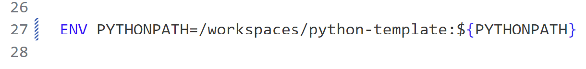
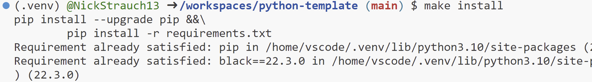
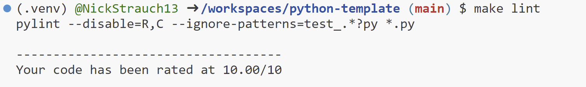
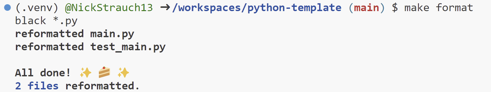
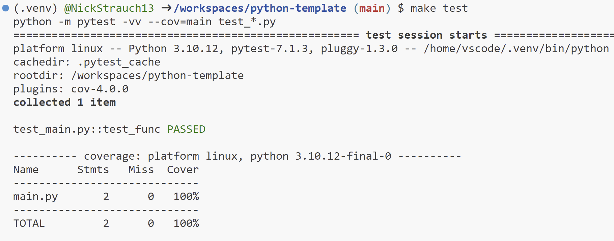

# Python Template

A general use Python template.

## About the template
- Inside the ``.devcontainer`` directory, you'll find a Dockerfile and devcontainer.json. The Dockerfile outlines how to construct the container, while other settings in this directory manage the development environment configuration.

**Note:** Modify the python path to the appropriate repository name in the Dockerfile:

- The ``.github/workflows`` directory houses GitHub Actions configurations, enabling the setup of automated pipelines for building, testing, and deploying your project.

- The ``.gitignore`` file is utilized to specify which files or directories should be excluded from version control when utilizing Git.

- A ``Makefile`` is present as a configuration file designed for automating tasks and facilitating software building in Unix-based systems. It contains instructions and dependencies for tasks like code compilation, test execution, and other development processes.

- The ``requirements.txt`` file is used to define the project's dependencies, including libraries and packages needed for its execution.

- For testing purposes, there's a ``test_main.py`` file designed to work seamlessly in various Integrated Development Environments (IDEs).

- The ``img`` directory is used to store any result images.

## GitHub Actions
GitHub Actions is used to run the Makefile in this order: `make install`, `make lint`, `make format`, `make test`.

``Makefile`` recipe results:
***

***

***

***

